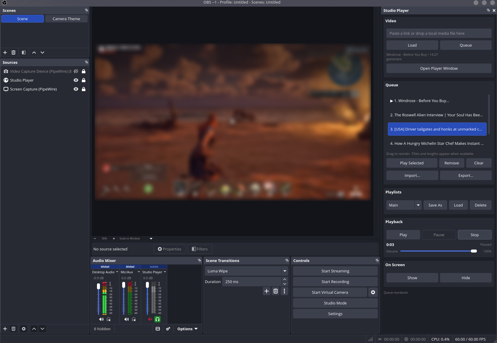
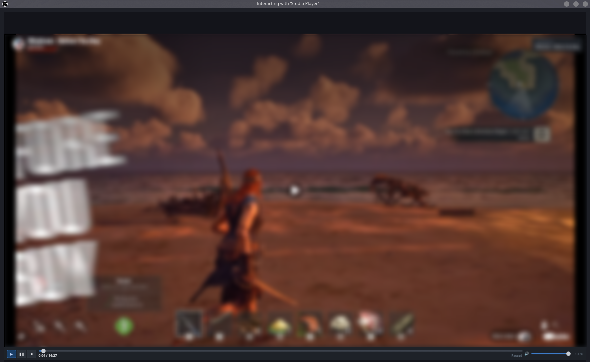

# Studio Player for OBS

<p align="center">
  <strong>Queue, play, pause, hide, and reuse local or web video sources from a dock inside OBS Studio.</strong>
</p>

<p align="center">
  <a href="https://github.com/Substazz/studio-player/releases/latest"></a>
  <a href="https://github.com/Substazz/studio-player/actions/workflows/build_project.yml"></a>
  <a href="./LICENSE"></a>
</p>

<p align="center">
  <a href="https://github.com/Substazz/studio-player/releases/latest/download/obs-studio-player-windows.zip">Windows</a>
  |
  <a href="https://github.com/Substazz/studio-player/releases/latest/download/obs-studio-player-macos.tar.gz">macOS Apple Silicon</a>
  |
  <a href="https://github.com/Substazz/studio-player/releases/latest/download/obs-studio-player-linux-x86_64.tar.gz">Linux x86_64</a>
  |
  <a href="https://github.com/Substazz/studio-player/releases">All releases</a>
</p>

Studio Player adds a dock to OBS that can load videos, maintain a queue, save playlists, and control a generated browser source named `Studio Player` in the active scene. It is designed for streamers and creators who want a lightweight local control surface for intro clips, intermission media, watch-party clips, stingers, reference videos, or any repeatable media workflow.

## Features

- Dock-based controls that live inside OBS.
- Local files, direct media URLs, YouTube links, Reddit posts, Twitch VODs, and Twitch clips.
- Queue support with drag-to-reorder, metadata lookup, import, export, and saved playlists.
- Playback controls for play, pause, stop, next, volume, show, and hide.
- Automatic browser source creation in the current scene.
- Frontend hotkeys for play, pause, stop, next, volume up, and volume down.
- GitHub-hosted releases with separate Windows, macOS, and Linux downloads.

## Screenshots

<p align="center">
  
  
</p>

## Install

Download the package for your operating system from the latest GitHub release:

https://github.com/Substazz/studio-player/releases/latest

GitHub also shows `Source code (zip)` and `Source code (tar.gz)` on every release. Those are automatic GitHub archives and are not the plugin packages. Use one of the `obs-studio-player-*` assets instead.

### Windows

1. Close OBS.
2. Download `obs-studio-player-windows.zip`.
3. Extract the zip into your OBS install folder:

```text
C:\Program Files\obs-studio\
```

After extraction, these files should exist:

```text
C:\Program Files\obs-studio\obs-plugins\64bit\obs-studio-player.dll
C:\Program Files\obs-studio\data\obs-plugins\obs-studio-player\player.html
```

Start OBS again. The `Studio Player` dock should appear after OBS finishes loading.

### macOS Apple Silicon

1. Close OBS.
2. Download `obs-studio-player-macos.tar.gz`.
3. Extract the archive.
4. Copy `obs-studio-player.plugin` into:

```text
~/Library/Application Support/obs-studio/plugins/
```

Terminal install:

```bash
mkdir -p "$HOME/Library/Application Support/obs-studio/plugins"
tar -xzf obs-studio-player-macos.tar.gz
cp -R obs-studio-player.plugin "$HOME/Library/Application Support/obs-studio/plugins/"
```

Start OBS again. If macOS blocks the unsigned plugin after downloading it from a browser, remove the quarantine flag and reopen OBS:

```bash
xattr -dr com.apple.quarantine "$HOME/Library/Application Support/obs-studio/plugins/obs-studio-player.plugin"
```

### Linux x86_64

This package is intended for a system OBS install, not Flatpak or Snap OBS.

1. Close OBS.
2. Download `obs-studio-player-linux-x86_64.tar.gz`.
3. Extract it into `/`:

```bash
sudo tar -xzf obs-studio-player-linux-x86_64.tar.gz -C /
```

After extraction, these files should exist:

```text
/usr/lib/obs-plugins/libobs-studio-player.so
/usr/share/obs/obs-plugins/obs-studio-player/player.html
```

Start OBS again. The `Studio Player` dock should appear after OBS finishes loading.

## First Setup

1. Open OBS and select the scene where the video should appear.
2. Paste a supported link or drag a local media file into the Studio Player dock.
3. Press `Load`.
4. Studio Player creates or updates a browser source named `Studio Player` in the current scene.
5. Use `Play`, `Pause`, `Stop`, `Volume`, `Show`, and `Hide` from the dock.

The browser source is created at `1920x1080`. Resize or crop it in OBS like any other source.

## Queues And Playlists

- Press `Queue` to add one or more links or local file paths.
- Drag queued items to reorder them.
- Double-click a queued item or press `Play Selected`.
- Use `Import` and `Export` for plain text queue files.
- Use `Save As`, `Load`, and `Delete` to manage named playlists.

## Hotkeys

Studio Player registers these OBS frontend hotkeys:

- `Studio Player: Play`
- `Studio Player: Pause`
- `Studio Player: Stop`
- `Studio Player: Next`
- `Studio Player: Volume Up`
- `Studio Player: Volume Down`

Configure them in OBS under `Settings` > `Hotkeys`.

## GitHub Releases

This project is designed to be hosted completely on GitHub. For OBSProject.com, you can link directly to:

```text
https://github.com/Substazz/studio-player/releases/latest
```

To publish a new version:

1. Push your changes to `main`.
2. Create a new tag such as `v1.0.2`.
3. The GitHub Actions workflow builds Linux, Windows, and macOS packages.
4. The final release job attaches the three platform assets to the GitHub Release.

If a release is marked as a pre-release, GitHub may not use it for the `/releases/latest` link. For public downloads, edit the release and uncheck `Set as a pre-release`.

## Build From Source

The CI workflow is the reference build. It builds against OBS `30.2.2`.

Linux example:

```bash
sudo apt-get install libobs-dev qt6-base-dev cmake ninja-build
cmake -B build -S . -G Ninja -DCMAKE_BUILD_TYPE=Release -DCMAKE_PREFIX_PATH=/usr
cmake --build build
DESTDIR="$PWD/release" cmake --install build
```

Windows and macOS builds need OBS development headers and Qt 6 available to CMake. See `.github/workflows/build_project.yml` for the exact CI setup.

## Support

If Studio Player does not appear after installing:

- Confirm that OBS was fully closed before copying files.
- Confirm that you downloaded the platform asset, not the automatic source archive.
- Confirm that the files landed in the expected install folders above.
- On macOS, remove the quarantine flag if OBS refuses to load the plugin.
- Open an issue with your OS, OBS version, and the package you downloaded.

<p align="center">
  <a href="https://www.buymeacoffee.com/substanzz">
    
  </a>
</p>
